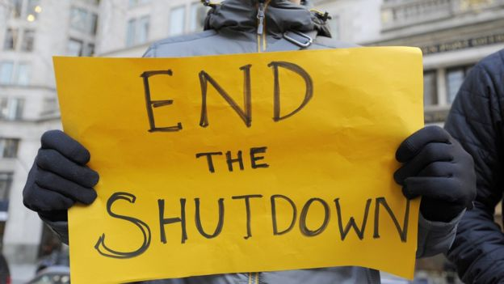

# **US shutdown: Trump urged to temporarily reopen government**

_The beginning of 2019_ came with the partial U.S. **government shutdown**. Half month has passed, the shutdown is still continuing, and **President Trump** is urging for temporarily government reopen. More details in the [article](https://www.bbc.com/news/world-us-canada-46858970).

Below is a brief summary of current situation:
>The partial government shutdown has now become the longest in US history.
It has left hundreds of thousands of public workers unpaid and government offices closed.
President Trump is refusing to approve a budget unless it includes $5.7bn (£4.5bn) for a wall along the Mexican border - a key campaign pledge, which the president said that Mexico would pay for.
Democrats have rejected his request for funding to build it and say they will not negotiate further until the government is reopened.

Of note:
- [How much has shutdown hit US economy?](https://www.bbc.co.uk/news/business-46815847)
- [How much of Trump's wall has been built?](https://www.bbc.com/news/world-us-canada-46748492)
- What is [government shutdown](https://www.washingtonpost.com/graphics/2018/politics/government-shutdown-faq/?noredirect=on&utm_term=.c0125e585760) ?
